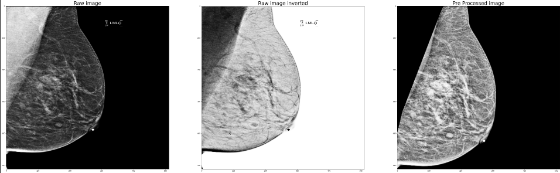

 Breast Cancer Detection from mammography screenings  

**This repository's aim is to offer a baseline framework which you can use easily to tackle Breast Cancer detection. You can find dataloaders, preprocessing pipeline (with different preprocessing steps among normalization, pectoral muscle removal...) and some models you can fine-tune easily. It was built to use RSNA-Screening-Mammography-Breast-Cancer-Detection dataset but one could adapt the repository to use it on any screening mammography dataset**   

 Table of contents

- [Installation and usage](#installation-and-usage)
- [The data](#the-data)
  - [Loaders](#loaders)
  - [Preprocessing](#preprocessing)
  - [Augmentation](#augmentation)
  - [Samplers](#samplers)
- [Models](#models)
  - [Backbones](#backbones)
  - [Classifier layers](#classifier-layers)
  - [Features as priors](#features-as-priors)
- [Usefull commands](#usefull-commands)

# Installation and usage

To use the repository, first you will need to add datasets to the repository. Data which is used in the repository is the data from RSNA kaggle competition you can find in this [link](https://www.kaggle.com/datasets/theoviel/rsna-breast-cancer-512-pngs) and the repository was built to use 512\*512 png images. Nonetheless if you want to use DCOM images, you will need to add an intermediate step in \_\_getitem\_\_ function in loaders (step similar to [link](https://www.kaggle.com/code/radek1/how-to-process-dicom-images-to-pngs)). 
If you want to use another dataset, you will need to keep a format similar to the one further described in "data" section.
You will need to add a train.csv and test.csv file in /data file. 
This repository first allows you to have a look to the data thanks to notebooks, and then to train models and to keep track of models with wandb. 
If you want to use wandb, you will need to add keys into private_config.yml.

# The data

First data is composed of tabular data about patients (stored in csv files in /data folder, with mandatory fields like "patient_id" and "image_id" that links to the corresponding mammographies and metadata such as "age", "machine_id" that could be used as priors for models). 
Mammographies are stored as f"{patient_id}\_{image_id}.png". 

## Loaders

For models' training, you can find loaders that gives {"image": img , "features": features, "label": label} with features being one-hot encoding of categorical features and numerical features if you decided to use features or {"image" : img, "label": label} if not.

## Preprocessing

Preprocessing pipeline is also available. You can see all possible features in the notebook pre_processing_visu.

<td>
 <b>All pre-processing pipeline</b>
</td></a>

<td>
 <b>Pectoral muscle identification</b>
</td></a>

## Augmentation

In order models not to overfit,you can use basic augmentations steps that are mainly used by the community [here](https://www.ncbi.nlm.nih.gov/pmc/articles/PMC9147240/). Further steps would be to implement GANs architecture augmentation like you can find [here](https://arxiv.org/pdf/2006.00086.pdf).

## Samplers

For better performance/convergence of models, two sampling methods are available: Stratified Sampling and Multinomial Sampling

# Models

## Backbones

3 available backbone models are available: ResNet, EfficientNet and ViT (with different pre-trained architectures).

## Classifier layers

On top of the backbone models, you can choose (in utils/config.py) which layers you want to add for the classification. For now, it only supports binary classification (predicts if cancer or not).

## Features as priors

Metadata can also be used in the models as priors (basically features extracted from backbone models are concatenated with features before being feeded to the classification layers).

# Usefull commands

To use the repository, you will need to add images dataset (in DCOM or PNG format) in a folder `kaggle_dataset` at the root of the project.

We advise you to use the docker configuration, but if one prefers to work without it, you will need to install requirements with `pip3 install -r requirements.txt`.

Be carefull, the repository is built to give the possibility to use a GPU. If you don't have a GPU on your computer, please comment lines below _deploy_ in the docker-compose file or it won't work.

**Build the container** 

> `docker-compose build`  

**Up containers** 

> `docker-compose up -d`  

**Stop containers** 

> `docker-compose stop`  

**Open a shell inside the main container** 

> `docker-compose exec rmbscd sh`

**Run jupyter lab from the container** 

> `jupyter lab --ip 0.0.0.0 --allow-root`

**If some issues with jupyter lab or port already on used on 8888**

> `lsof -i :8888`   > `kill -9 <PID>`  
> With PID being the process ID of python (for notebook)

**Run training model**

> `python3 train.py --images_dir "kaggle_dataset" --csv_file_path "data/train.csv" --model "EfficientNet" --num_epochs 5 --multinomial_sampler --batch_size 14 --wandb --basic_augmentation --duplicate_channels --include_features `
